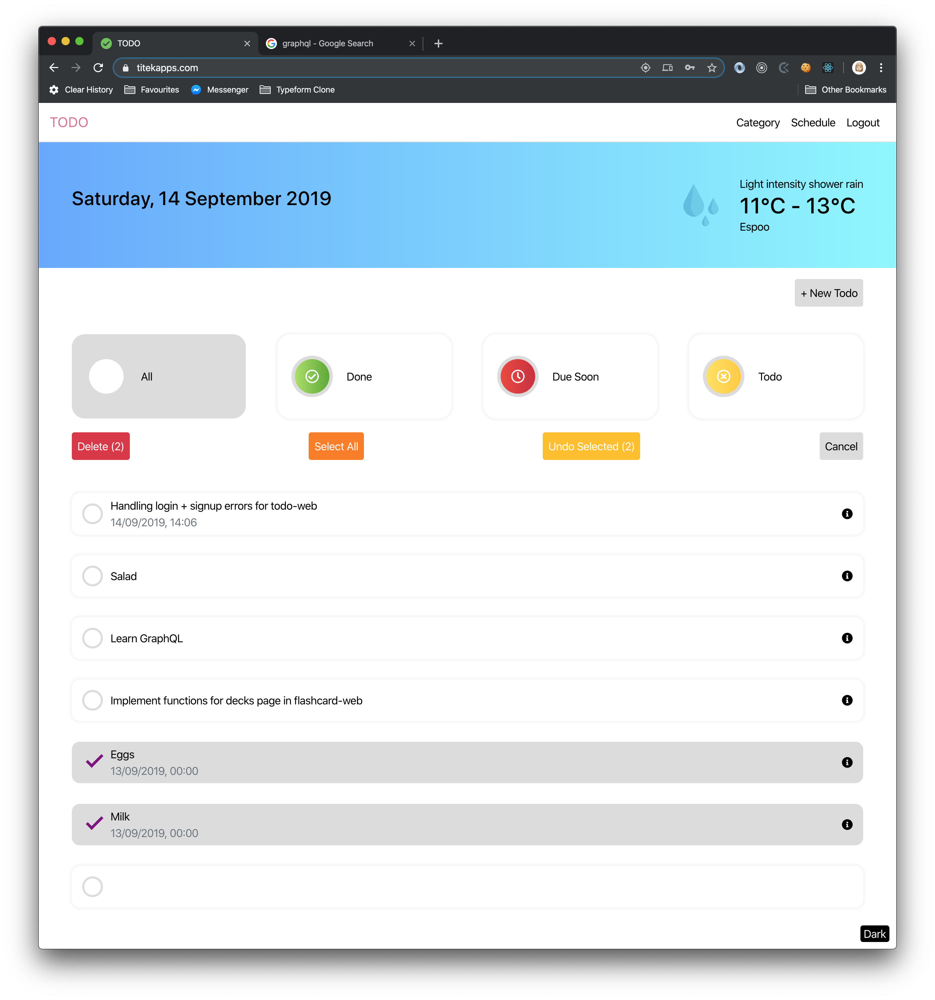

# TODO-web
>A todo web application

Check it out [here](http://www.titekapps.com)

## Features
- Sign up, login
- Create, edit, delete, sort todo
- Create category
- Create schedule

## Installation
1. Clone project

2. Make sure you have installed Node.js and npm

	* [Download Node.js](https://nodejs.org/en/download/)

	* Check with commands

		`node -v`

		`npm -v`

3. In the project directory, you can run

	`npm install`

	Install the dependencies in the local node_modules folder

4. In the project directory, you can run

	`npm start`

	Runs the app in the development mode

5. Open [http://localhost:3000](http://localhost:3000) to view it in the browser.

## Languages
* HTML
* SCSS
* JSX
* JavaScript

## Libraries
* [React](https://reactjs.org)
* [ReactJS Datepicker](https://reactdatepicker.com)
* [Moment](https://momentjs.com)
...

## Frameworks
* [Bootstrap](https://getbootstrap.com)

## API Reference 
* Backend was NOT built by me. Documentation [here](http://muzify.eu/swagger-ui.html#/)

## Author
* Ngoc Doan (ngocdh236@gmail.com)
